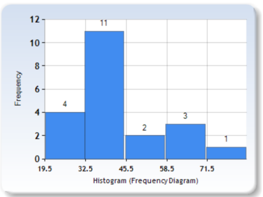
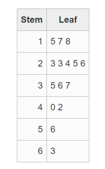

# Review for Quiz – Statistics Math 210

## Question 1

Given the following frequency histogram, find:

- A) The sample size that was analyzed
- B) What is the cumulative frequency of class 2?
- C) What is the midpoint of class 3?
- D) What is the class width?

## Question 2

1. It is estimated that 36% of the students are bored in their Statistics class. If a random sample of 15 students from this population is examined, find the probability that:

- a) 3 students will say they are bored in class.
- b) Fewer than 2 will say they are bored in class.
- c) What is the expected value of students bored in their Statistics class?
- d) What is the standard deviation for the number of students bored in their Statistics class?
- e) At least 3 students will say they are bored in class.

## Question 3

2. At a city high school, past records indicate that the literacy test scores for students are normally distributed with a mean of 67% and a standard deviation of 12%. If one student is randomly selected, what is the probability that their score will be more than 70%?

## Question 4

For the following sample data below representing the amount of time (in hours) groups of students spent in completing a Statistics project, find: 5, 7, 12, 8, 8, 12

- a) The mean;
- b) The median;
- c) The midrange;
- d) The standard deviation;
- e) The 58th percentile;

## Question 5

For the data in the stem and leaf graph below, find:

- A) First quartile;
- B) Third quartile;
- C) The interquartile range;

Key: 2|3 means 23 lbs.

## Question 6

7. The height of trees in a nursery is normally distributed with a mean of 45 cm and a standard deviation of 15 cm. Find:

- a) The probability that a tree will have a height above 40 cm
- b) The probability that a tree will have a height below 40 cm
- c) The height that separates the top 10% of the heights from the rest
- d) The height that separates the bottom 15% from the rest
- e) The 87th percentile

## Question 7

8. For the following bivariate data, find the regression line: \( y = b_0 + b_1x \)

**x** | **y**
--- | ---
21 | 12
34 | 11
35 | 9
46 | 9
47 | 6
73 | 4

- a) ∑x
- b) ∑y
- c) ∑x2
- d) ∑y2
- e) ∑xy
- f) \( b_1 \) (round to 2 decimal places)
- g) \( b_0 \) (write your answer to one decimal place)
- h) Coefficient of correlation
